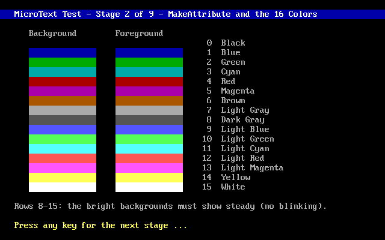

# **MicroText**<br>*Text Mode Library for MS-DOS*


<p align="center">
  
</p>

## 📑 Table of Contents

- [✨ Features](#-features)
- [🚀 Quickstart](#-quickstart)
- [📖 API Overview](#-api-overview)
- [🔨 Build the Test Driver](#-build-the-test-driver)
- [📂 Repository Structure](#-repository-structure)
- [⚙ Technical Details](#-technical-details)
- [📄 License](#-license)

<br>

## ✨ Features

MicroText is a low-level text-mode screen library for MS-DOS, written in C with inline x86 assembly. It models the text screens and off-screen buffers as a struct, `TEXTBUFFER`. `TEXTBUFFER` is a rectangular grid of hardware text cells laid out exactly like video memory at segment `0xB800` Everything else in the library is built on that one abstraction.

- Flicker-free double buffering — composite into an off-screen `TEXTBUFFER`, then blit to `0xB800` with a single `REP MOVSW`.
- Character and string plotting with per-call foreground and background transparency, and automatic clipping to the destination buffer.
- Box-art primitives — horizontal and vertical lines and rectangles, in single or double thickness, with automatic box-drawing union where lines cross and end caps that join cleanly into existing frames.
- Block save and restore (`GetTextBlock` / `PutTextBlock`) and shadow casting (`PutShadow`), the primitives behind pop-up menus and dialogs.
- Text-mode control across 25-, 43-, and 50-row modes, plus hardware cursor show/hide/position.
- Keyboard helpers — polling, blocking reads, peek-without-consume, and shift-state queries — plus an optional `INT 9` handler that adds true key-held (`KeyDown`) detection.
- Every plotting function clips to the destination buffer's bounds, so out-of-range coordinates are silently trimmed rather than corrupting memory.

<br>

## 🚀 Quickstart

MicroText is a two-file library — drop `mtext.c` and `mtext.h` into your project, include the header, and compile the module alongside your own sources. There is nothing to install and no runtime dependency beyond the DOS BIOS.

```c
#include "mtext.h"

int main ( void )
{
    TEXTBUFFER screen;

    SetTextMode ( 25 );

    screen = CreateTextBuffer ( 80, 25, COLOR_LIGHT_GRAY, COLOR_BLUE );

    ClearTextBuffer ( &screen, ' ', COLOR_LIGHT_GRAY, COLOR_BLUE );
    PutText         ( &screen, 2, 1, "Hello, MicroText.", COLOR_WHITE, COLOR_BLUE, 0, 0 );
    FlipScreenBuffer ( &screen );

    ReadKey ();

    DestroyTextBuffer ( &screen );

    return 0;
}
```

Compile it with the Borland C++ 3.1 command-line driver, large memory model:

```dos
bcc -c -ml -2 -I..\src ..\src\mtext.c
bcc -c -ml -2 -I..\src myapp.c
bcc -ml -emyapp.exe mtext.obj myapp.obj
```

The large memory model (`-ml`) is required — `TEXTBUFFER` cells are `far` pointers and off-screen buffers come from `farmalloc`. The `-2` flag targets the 80286; a plain 8086 is not supported.

<br>

## 📖 API Overview

| Group | Functions |
|-------|-----------|
| Screen / mode | `SetTextMode`, `GetTextMode`, `FlipScreenBuffer` |
| Buffer lifecycle | `CreateTextBuffer`, `DestroyTextBuffer`, `ClearTextBuffer`, `CopyTextBuffer` |
| Plotting | `PutCharacter`, `PutText` |
| Box art | `PutHorizontalAsciiLine`, `PutVerticalAsciiLine`, `PutAsciiRectangle` |
| Blocks / shadow | `GetTextBlock`, `PutTextBlock`, `PutShadow` |
| Attributes / cursor | `MakeAttribute`, `ShowCursor`, `HideCursor`, `SetCursorPosition` |
| Keyboard | `KeyPressed`, `ReadKey`, `PeekKey`, `GetShiftState` |
| Key-held detection | `InstallKeyboardHandler`, `RemoveKeyboardHandler`, `KeyDown` |

A character cell is a 16-bit word:
- The low byte is the character code.
- The high byte is the attribute, where `attribute = (background << 4) | foreground`.
- The row stride is `width * 2` bytes.

<br>

## 🔨 Build the Test Driver

The `test/` directory holds an interactive nine-stage driver that exercises the whole library, each stage advanced with a key press: core pipeline, colors, plotting and clipping, box art, buffer copy, block and shadow, cursor, text modes, and keyboard.

Requires MS-DOS, or a DOS emulator like [DOSBox](https://www.dosbox.com/), with the Borland C++ 3.1 command-line driver (`bcc`) on the `PATH`. Run from the `test/` directory inside an already-configured DOSBox session:

```dos
cd test
BUILD.BAT
TEST.EXE
```

The `.obj` files, `TEST.EXE`, and `BUILD.LOG` all land in `test/`. Run `BUILD.BAT clean` to remove them.

<br>

## 📂 Repository Structure

```
Micro Text
├─ src             MicroText library
│  ├─ mtext.c      Implementation (C + inline x86 asm)
│  └─ mtext.h      Public API
│
├─ test            Nine-stage interactive test driver
│  ├─ build.bat    Builds TEST.EXE (build clean to remove artifacts)
│  └─ test.c       Driver source
│
├─ README.md
└─ LICENSE
```

<br>

## ⚙ Technical Details

- **Target OS:** MS-DOS 3.30, or above.
- **Target CPU:** 80286 / 80386 / 80486, real mode (compiled with `-2`; a plain 8086 is not supported).
- **Memory model:** Large (`-ml`), far code + far data, with `farmalloc`-ed off-screen buffers.
- **Display:** Direct `0xB800` hardware text mode (80×25, or 43/50 rows), one word per cell (character + attribute).
- **Double buffering:** The caller composites into an off-screen `TEXTBUFFER`, then a single `FlipScreenBuffer` (`REP MOVSW`) blits it to `0xB800`, flicker-free.
- **Fill idiom:** Buffer fills use `REP STOSW`, one word per cell.
- **Toolchain:** Borland C++ 3.1 (`bcc`), with the `asm { }` blocks handled by the built-in inline assembler — no separate TASM pass.

### Projects Using MicroText

- **[MicroApp](https://github.com/rohingosling/micro-app)** — a C++ text-mode application framework built directly on MicroText.
- **[Data Probe](https://github.com/rohingosling/data-probe)** — a full-screen DOS HEX editor, built on MicroApp and MicroText.

<br>

## 📄 License

Released under the [MIT License](LICENSE) — Copyright © 1992 Rohin Gosling.
